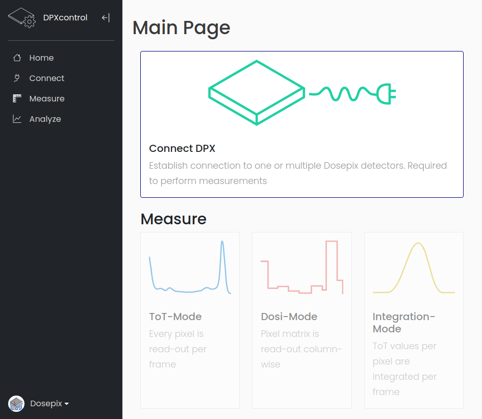

<p align="center">
  
</p>

# Dosepix-Control GUI

Author: Sebastian Schmidt  
E-Mail: schm.seb@gmail.com  

GUI for [dpx-control](https://github.com/dosepix/dpx_control) via [dpx-control-api](https://github.com/dosepix/dpx-control-api). The API hosts a flask server which connects to an [electron.js](https://www.electronjs.org)-app.  

## Installation

Install [dpx-control](https://github.com/dosepix/dpx_control) and [dpx-control-api](https://github.com/dosepix/dpx-control-api) first. dpx-control is available via `pip install`, dpx-control-api only via github at the moment. Please follow the instructions on the specific sites.  
Download the dpx-control-gui from github and install via `npm` by running  
``` npm install ```
in the project's folder. Finally, run the program via
``` npm run ```

## Docker

A docker-image can be build via  
``` docker build -t dpx_gui ```
and executed via  
``` docker run -e DISPLAY=unix$DISPLAY --cap-add=SYS_ADMIN dpx_gui ```

## Features

<p align="center">
  
</p>

- Connect the detector by selecting the port and specifying the baud-rate

- Create users and store their configurations and measurements in a SQL-database

- Create new configurations, THL calibrate and equalize a connected detector. Multiple calibrations and equalizations are possible and selectable during connection

- Perform measurements in various modes, including ToT, Dosi, and Integration

- During measurement, an interactive plots shows the acquired data. Here, things like the shown pixels or the ToT-range can be adjusted on the fly

- Registered data is stored in a database and can be shown in the corresponding menu. Here, the data can be exported in json-format and can be used in succeeding analyses

- A neural network is employed to calibrate the detector for short a shor ToT-measurement with an Am241-source and a Mo-XRF target. The calibration is stored in the database and can be selected to convert registered ToT-values to deposited energy on the fly

## Questions, Suggestions and Issues

Feel free to open new issues on github or send me an E-mail if questions or problems arise!
